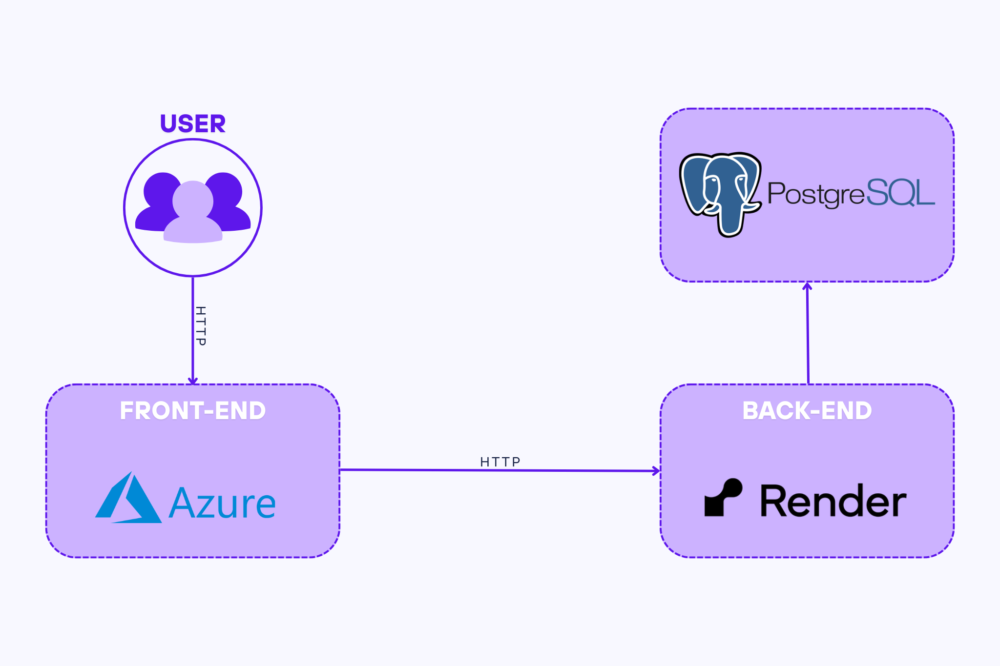

# 📚 Študijný Tracker – Dokumentácia  
### *(Webová aplikácia s cloudovým prepojením)*

---

## 🧠 1. Analýza úlohy

Cieľom riešenia bolo vytvoriť jednoduchú webovú aplikáciu, ktorá umožňuje používateľom zaznamenávať a spravovať svoje študijné aktivity.

### Hlavné požiadavky:
- Ukladanie dát do databázy  
- Prehľadné webové rozhranie  
- Možnosť pridávania, mazania a prezerania záznamov  

🔧 Aplikácia je rozdelená na **frontend**, **backend** a **databázu**. Každý komponent je nasadený v inom prostredí.

---

## 🛠️ Zvolené technológie

- ⚙️ **Render**: Nasadenie backendovej služby 
- 🌐 **Azure Static Web Apps**: Hosting frontendovej aplikácie  
- 🐙 **GitHub**: Verzionovanie, tímová spolupráca, centrálny repozitár  
- 🐘 **PostgreSQL**: Databáza na ukladanie študijných údajov  
- 🤖 **Gemini (AI)**: Analyzuje vstupy a generuje odpovede pre používateľa  

---

## 🗺️ Diagram použitých služieb

---
Diagram použitých služieb – popis
Naša aplikácia je rozdelená na tri hlavné komponenty: frontend, backend a databázu. Každý komponent je nasadený v inom prostredí a spolu komunikujú prostredníctvom protokolu HTTP.

🧑‍💻 Používateľ (USER)
Používateľ pristupuje k aplikácii cez webový prehliadač. Požiadavky (napr. načítanie stránky, odoslanie formulára) sú smerované na frontend aplikácie.

🖥️ Frontend (Azure Static Web Apps)
Frontend je nasadený v službe Microsoft Azure – konkrétne v Azure Static Web Apps. Poskytuje používateľské rozhranie (UI), ktoré zobrazuje dáta a umožňuje interakciu. Požiadavky na dynamické údaje (napr. z databázy) posiela na backend cez HTTP.

⚙️ Backend (Render)
Backend aplikácie beží na Render. Spracúva všetky požiadavky z frontendu – autentifikáciu, ukladanie a získavanie dát z databázy.

🗄️ Databáza (PostgreSQL)
Na ukladanie dát používame relačnú databázu PostgreSQL. Backend komunikuje s databázou – posiela a číta údaje potrebné na fungovanie aplikácie.

---

## 👥 Rozdelenie práce

- **Mariana Tomiová**: Backend (cloud) + AI  
- **Dominik Vojtko**: Backend + databáza  
- **Viktória Kešeľáková**: Frontend + dokumentácia  
- **Jakub Fekete**: Frontend (cloud) + prepojenie frontend-backend  

---

## 🚀 Spustenie aplikácie

> 💡 *Používateľ nepotrebuje nič inštalovať – aplikácia je plne dostupná online.*

### 🔗 Otvorte aplikáciu:
👉 [https://delightful-pond-073a63a1e.6.azurestaticapps.net/](https://delightful-pond-073a63a1e.6.azurestaticapps.net/)

---

### 🧭 Postup:

1. Otvorte ľubovoľný internetový prehliadač (napr. Google Chrome, Microsoft Edge, Mozilla Firefox).  
2. Do adresného riadku zadajte URL vyššie.  
3. Stlačte **ENTER**.  
4. Po načítaní sa zobrazí používateľské rozhranie aplikácie.  
5. Môžete začať zaznamenávať svoje študijné aktivity, upravovať ich a prehliadať.  
6. Po skončení práce jednoducho zatvorte kartu v prehliadači.  

---

> 📬 *Ak máte otázky alebo návrhy na zlepšenie, neváhajte vytvoriť issue v repozitári.*
